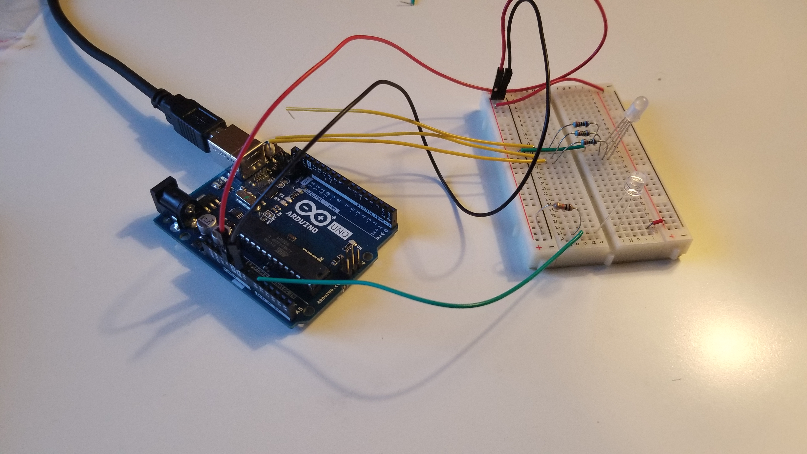

Night night which shows what phase of the night it is.
<!--more-->

---
# Introduction
## Abstract
This project is night light where the central “moon” figure rotates according to what time of the night it is. The light is on with two conditions, the environment has to be dark and button is pressed. There are many products with either night light function or time function, but there are not many objects that has subtle and passive indication of time. This Arduino project will be useful for people who does not need specific time of the night, but just have a general idea of how much time has passed after going for sleep.

I have connected phototransistor to measure how much light is being emitted by surrounding environment. When the surrounding light level is below certain point, night light activates, and LED emits light. The servo in the middle also rotates the “moon” shape. The angle of the moon depends on what time of the night. It starts on the left then moves towards right of the night light.

# Sketches
## Sketches
(Insert Sketches)

## Circuit Schematic
(Insert Sketches)

## Product in building
(Insert photos)

# Conclusion
## Final Product

[Demo Video](https://youtu.be/9T15qEF5nGI)

[Github Repository](https://github.com/hanum-lee/Tangible-Interface)

### References
* [Switch Tutorial](https://www.arduino.cc/en/tutorial/switch)

